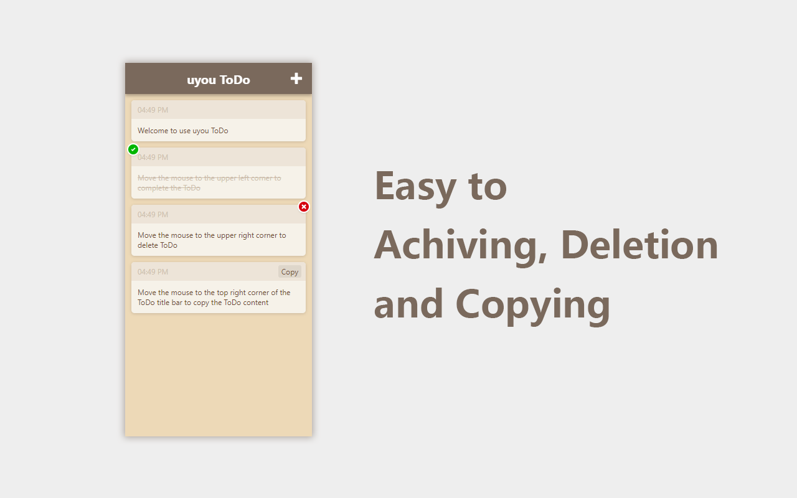

# uyou-todo-web
 
English | [中文简体](https://github.com/tonylu110/uyou-todo-page/blob/main/README/zh_cn.md)

## How to use ?

1. Build
    ``` 
    yarn
    yarn build
    ```
2. run in web server

## Preview


